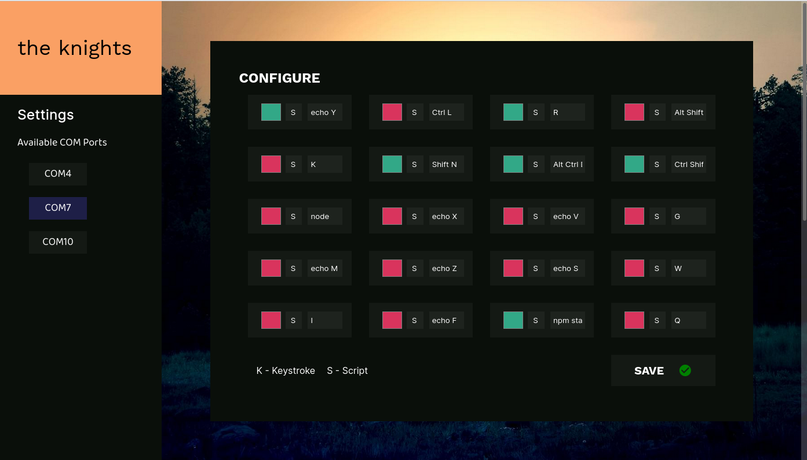
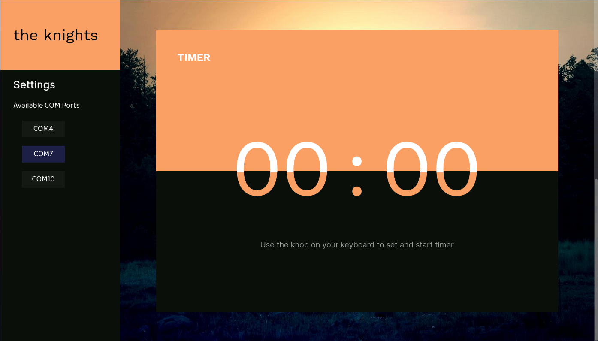

# Frontend Dashboard

An impressively fast dashboard powered by Svelte and Material Icons

## Configure

Configure each key to a keypress, or a series of keypresses or a script

## Timer

You can also configure one of your keys to start a timer and also use the onboard knob to change the timer's time

## Todo
- [x] Complete Basic Design
- [ ] Make it Responsive
- [ ] Intergrate it with Backend
- [ ] Get an Icon
